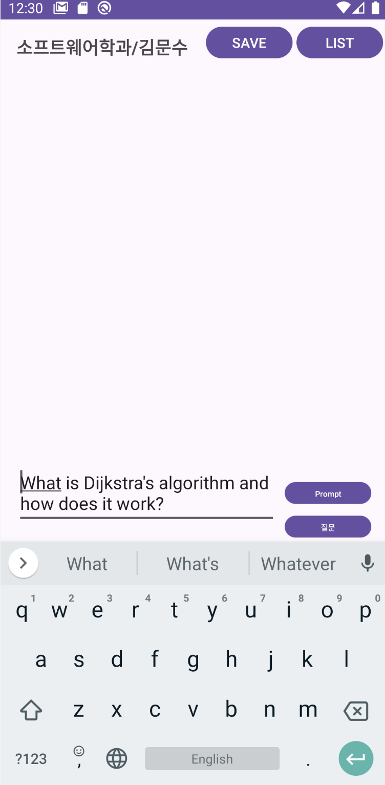
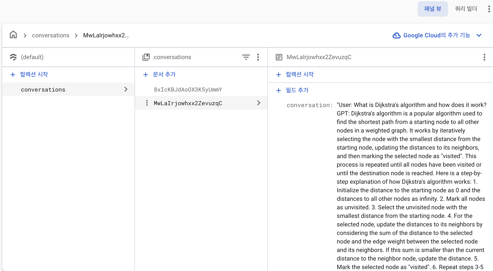

# Prompt-Enhanced AI Chatbot Platform

> **Kotlin(Android) · OkHttp3 · OpenAI API · Firebase Auth · Firestore DB**  
> 사용자 인증, 대화 저장/조회/삭제, 프롬프트 엔지니어링 기반 응답 품질 개선을 통합한 **End-to-End AI 챗봇 애플리케이션**

---

## 프로젝트 개요
이 프로젝트는 **모바일앱프로그래밍 실습(1인 개발)** 과제로 수행된 **AI 챗봇 플랫폼**이다.  
사용자는 이메일/구글 로그인을 통해 인증 후, OpenAI GPT와 실시간 대화를 주고받을 수 있다.  
또한 **프롬프트 리파인먼트(Question Refinement)** 기법을 적용하여 단순 입력보다 전문가 수준의 질문을 생성하고,  
Firestore DB를 통해 대화를 저장·조회·삭제할 수 있는 **개인화 대화 관리 플랫폼**을 구축했다.

---

## 주요 기능 & 스크린샷

### 1. 사용자 인증 (Firebase Auth)
- 이메일 로그인 / 회원가입
- Google 계정 로그인 및 로그아웃 지원  

   
   
   

---

### 2. Firebase Auth 연동 확인
- 로그인 후, Firebase Auth 대시보드에 사용자 계정이 등록됨  

  

---

### 3. 프롬프트 엔지니어링 (Question Refinement)
- **입력 전 → Refinement 후** 질문 품질 향상  

  
  

예시:  
- 입력: *“I want to know about Djikstra”*  
- Refinement(Prompt 버튼) → *“What is Dijkstra's algorithm and how does it work?”*  

---

### 4. 챗봇 대화 (OpenAI API)
- OpenAI GPT(gpt-3.5-turbo) API 연동  
- RecyclerView 기반 실시간 대화 UI  

  

---

### 5. Firestore DB 기반 대화 관리
- **SAVE** 버튼 → 대화 저장  
- **LIST** 버튼 → 대화 목록 확인  
- **CLEAR** 버튼 → 대화 삭제  

  
  

    

삭제 후 → 빈 화면  

  

---

## 성과 & 학습 포인트
- **End-to-End 플랫폼 개발 경험**: 클라이언트(Android) ↔ API(OpenAI) ↔ DB(Firestore)까지 파이프라인 구현  
- **프롬프트 엔지니어링 적용**: Question Refinement 기법을 통해 응답 품질 개선  
- **실무형 설계 경험**: 사용자 인증, 데이터 영속성, 삭제 기능까지 포함한 개인화 챗봇 플랫폼 완성  

---

## Repository 구조

  

